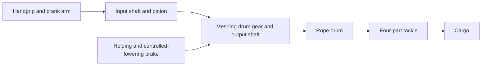

# Crane mechanism details — crank clarified, mechanics still under review

Human accepted the visual direction. This does not close the mechanical blockers below.

## Hand crank

The hand crank is the long arm at lower left, with the operator gripping its end.
It connects to the small input-gear shaft. The shorter handle at upper right is a
different control; its rendered attachment does not by itself establish a brake.

The intended drive and holding connections are:

## Tackle detail

Four supporting strands are visible, but an exact continuous route must still be
established. Intended route: upper becket → lower sheave 1 → upper sheave 1 → lower
sheave 2 → upper sheave 2 → winch. Labels and rope count alone do not validate it.

Both reviewers confirm the crank and gear engagement are clearer. They still reject
these as complete mechanism explanations: the auxiliary wheel is disconnected,
brake action is unclear, and rope continuity is not established. Retained as visual
proposals; neither certifies ratios or lifting capacity. No more overall/detail
regeneration in this bounded batch.
[Detailed evidence and reviews](targets/KIT-037-mechanism-details.md) ·
[Fishing vessel and overall crane direction](concept-art-batch-022-review.md).
