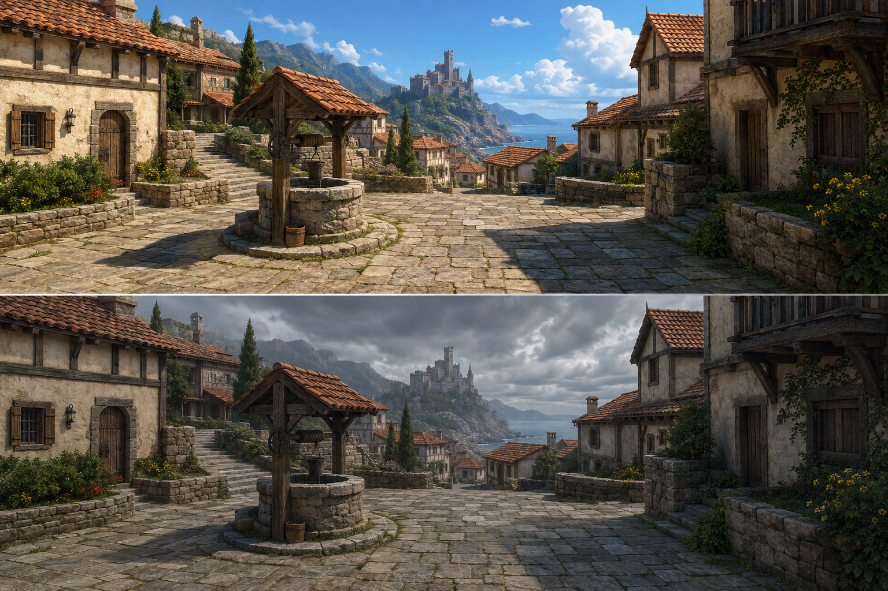

# D1 courtyard reference candidate

Status: human-endorsed quality benchmark; finished runtime acceptance pending. This is concept
art, not an implemented-game capture, a measured lighting result, or approved library
content. See [the kit specification](d1-courtyard-kit.md).

## Direction and inspection

The upper panel establishes warm limestone paving/plinths, cream lime plaster, dark oak,
terracotta roofs, and restrained green planting under bright sunlight. The lower panel
retains the architecture and broadly matching framing under cool overcast illumination.
The open lane beside the well and castle silhouette remain readable in both states.
Agent inspection found no reason for a second generation cycle for this direction review.

The sheet is a material/composition reference, not a new world-layout contract. Its steep
lane, coastal castle placement, terraces, and planting cannot move authored terrain,
collision, castle/moat, or village-well transition coordinates. Small generated panel
differences are not acceptable as runtime weather-dependent geometry. There is no exact
pixel correspondence, scale proof, or inferred GPU lighting capability in this image.
Final placement must be inspected in the existing streamed world from near, mid, and
castle-vista cameras. The production well must keep the existing entrance accessible.

## Provenance

- Created 2026-09-05 by Codex using the built-in imagegen tool; output metadata identifies
  gpt-image 2.0. One generation, no edits; no seed was exposed.
- Inputs: original text below, `docs/game-design.md` setting/art direction and D-182;
  no third-party reference images supplied.
- Output: `d1-courtyard-sunny-gloomy.png`, 1536 x 1024 PNG; SHA-256
  `f9a4e66ee9e259451234b1832383264212e7239f7a2b34ba15c370f2f77df9a7`.
- Original tool output retained in the machine-local Codex generated-images directory.
- Rights review: **pending**. Applicable OpenAI account/output terms must be recorded
  and reviewed before derived art ships publicly; no rights clearance is asserted here.
  Internal visual direction only. Reference images are allowed in git under assets rules;
  P-004 remains open for source/library binaries.

## Exact generation prompt

Use case: stylized-concept. Create a high-quality original game environment reference sheet for Project Parallax, a medieval coastal fantasy village. Two wide panels stacked vertically, exactly the same eye-level camera and same physical courtyard geometry in both: top bright vibrant sunny daylight, bottom gloomy overcast storm approaching. Plausible richly detailed PBR game-art target, strong readable shapes, natural material texture, no cartoon outlines. A modest village well in a small paved courtyard, human-scale cream lime-plaster houses with dark oak structural beams and warm terracotta tiled roofs, limestone plinths and low garden walls, restrained green foliage tufts and shrubs. Broad unobstructed walkable route passes the well toward the village lane. Distant central hilltop stone castle above roofs as clear silhouette, mountain backdrop and a subtle coastal atmosphere. Camera 1.7m high, approximately 55-degree horizontal field of view. Bottom panel changes only sky and illumination, no added objects, no relocated architecture, no night lights, no rain effects, no altered materials. Daylight warm sun and cool open shadows, colorful and inviting, storm panel cool desaturated illumination but still readable materials and path. No people, no text, no logos, no copyrighted fantasy designs. This is concept reference, not a screenshot of implemented game. Save output image into D:/src/parallax/assets/reference/d1-courtyard-sunny-gloomy.png if local saving is available.
